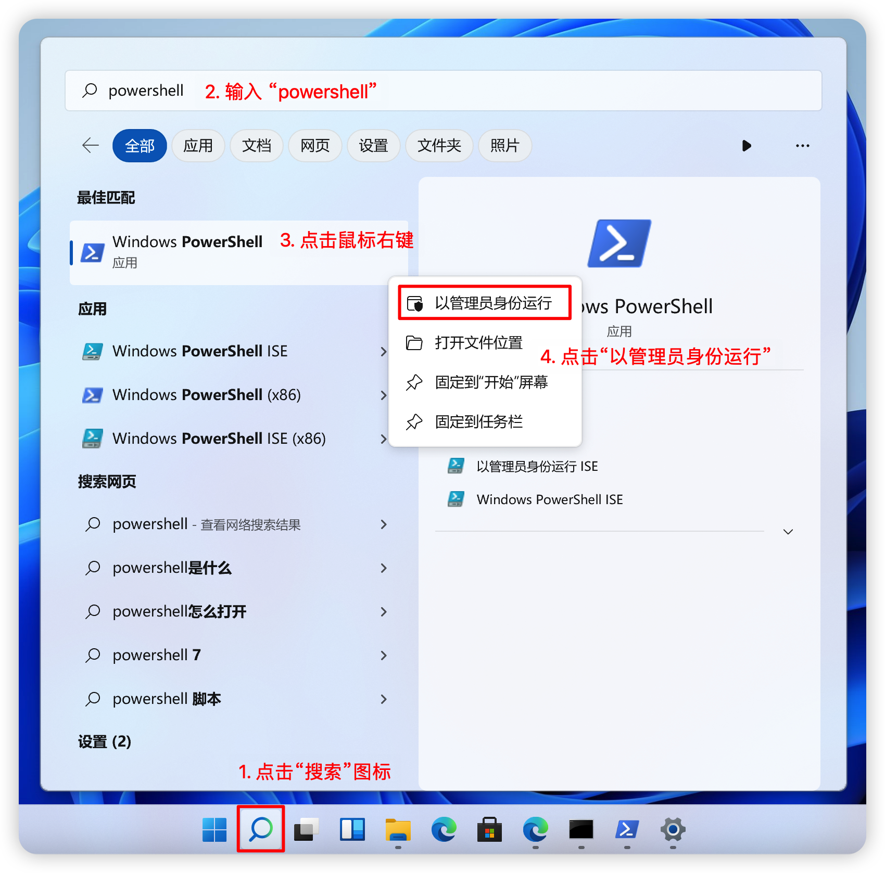
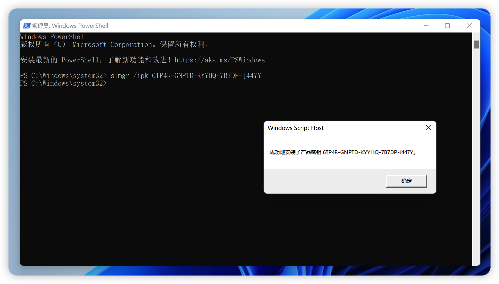
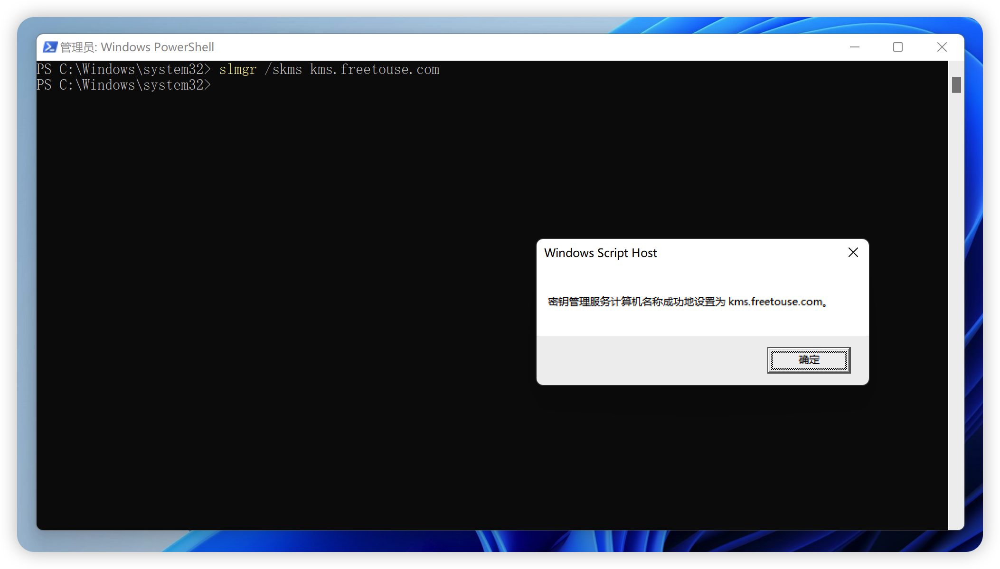
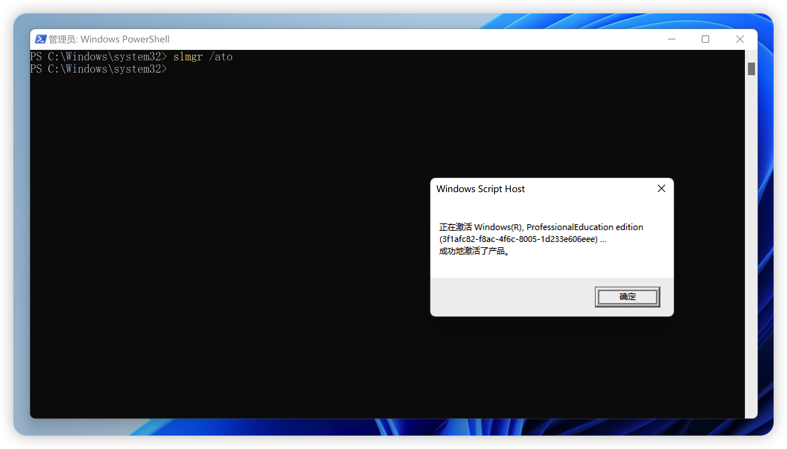
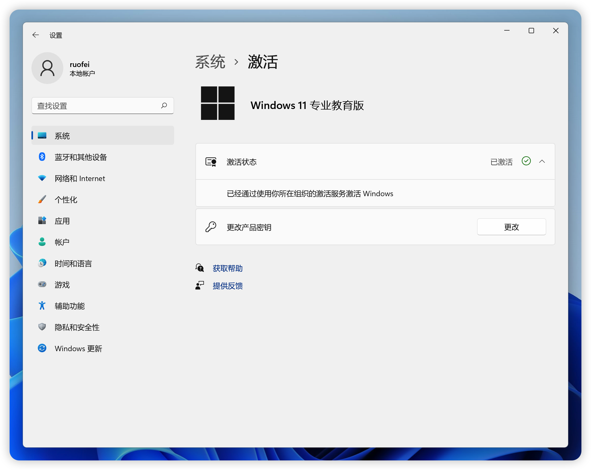

本教程将指导你如何使用我们提供的 KMS 服务器激活 Windows 系统。

若要使用 KMS，需要有一个可用的 KMS 主机——使用我们开放的 KMS 主机即可。使用 KMS 主机激活的计算机需要具有特定的产品秘钥，如果你没有这些秘钥，可以使用我们提供的 KMS 激活秘钥。你可以在[这里](./gvlk)找到 KMS 激活秘钥。这些秘钥有时称为 KMS 客户端激活秘钥，但其正式名称为 Microsoft 通用批量许可证密钥 (GVLK)。默认情况下，运行 Windows Server 和 Windows 客户端批量许可版本的计算机是无需额外配置的 KMS 客户端，因为相关 GVLK 已经存在。

但是，在某些情况下，需要将 GVLK 添加到要针对 KMS 主机激活的计算机，例如：

- 转换计算机使其不使用多次激活密钥 (MAK)
- 将 Windows 的零售许可证转换为 KMS 客户端
- 如果计算机以前是 KMS 主机。

## 安装产品密钥

如果要将计算机从 KMS 主机、MAK 或零售版 Windows 转换为 KMS 客户端，则从以下列表中安装适用的产品密钥 (GVLK)。 若要安装客户端产品密钥，请在客户端上打开 powershell 或 cmd。这里以 PowerShell 为例，以管理员身份运行 PowerShell：



以 PowerShell 为例，输入一下命令，然后按 Enter：

```powershell
slmgr /ipk <product key>
```

下面我们以 Windows 11 教育版系统为例，输入以下命令并按下键盘上的 Enter 键：

```powershell
slmgr /ipk 6TP4R-GNPTD-KYYHQ-7B7DP-J447Y
```

上面 `/ipk` 后的 `6TP4R-GNPTD-KYYHQ-7B7DP-J447Y` 为产品密钥，你可以在[这里](./gvlk#windows-11-和-windows-10半年频道版本)找到对应版本的产品密钥。这句话的意思是，安装 `6TP4R-GNPTD-KYYHQ-7B7DP-J447Y` 产品密钥。如果一切顺利，你将看到以下消息：



到此，我们便成功安装了产品密钥。下面，我们将激活系统。

## 连接到 KMS 服务器

在安装了产品密钥后，我们需要连接到 KMS 服务器。在这里，使用我们提供的 KMS 服务器。

```powershell
slmgr /skms kms.freetouse.com
```

上面 `/skms` 后的 `kms.freetouse.com` 为我们提供的 KMS 服务器地址。这句话的意思表示连接到 `kms.freetouse.com` KMS 服务器。如果一切顺利，你将看到以下消息：



看到该消息后，我们便成功连接到 KMS 服务器。

## 激活系统

在连接到 KMS 服务器后，我们需要激活系统。在这里，我们使用以下命令：

```powershell
slmgr /ato
```

上面 `/ato` 为激活系统的命令。如果一切顺利，你将看到以下消息：



我们看到，提示框中显示“成功的激活了产品。”，说明我们已经成功激活了系统。我们可以打开系统设置，进一步查看激活状态：



我们看到，系统显示“已激活”，至此，说明我们已经成功激活了系统。

通过我们提供的 KMS 服务器，你可以激活 Windows 10、Windows 11、Windows Server 2012、Windows Server 2016、Windows Server 2019、Windows Server 2022 等系统，激活周期为 180 天。当激活周期到期后，系统会自动重新激活。

:::tip
如果你要安装一个新的 Windows 系统，你可以在[这里](./download)找到受支持的 Windows 系统镜像。本站提供的镜像均为原版镜像，没有任何修改，你可以放心使用。
:::
