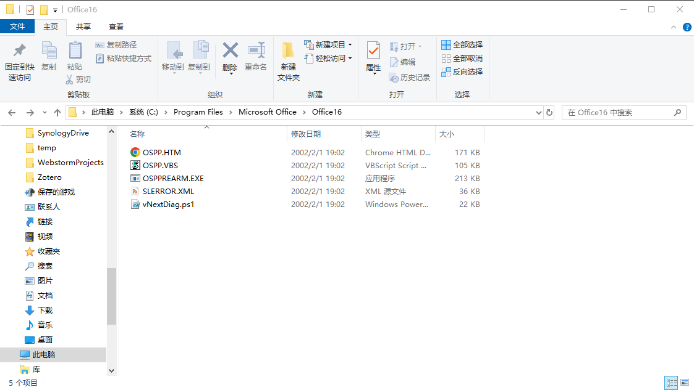
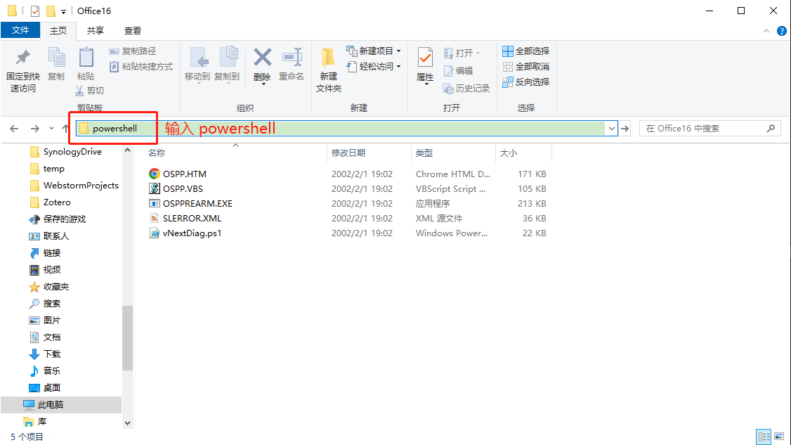
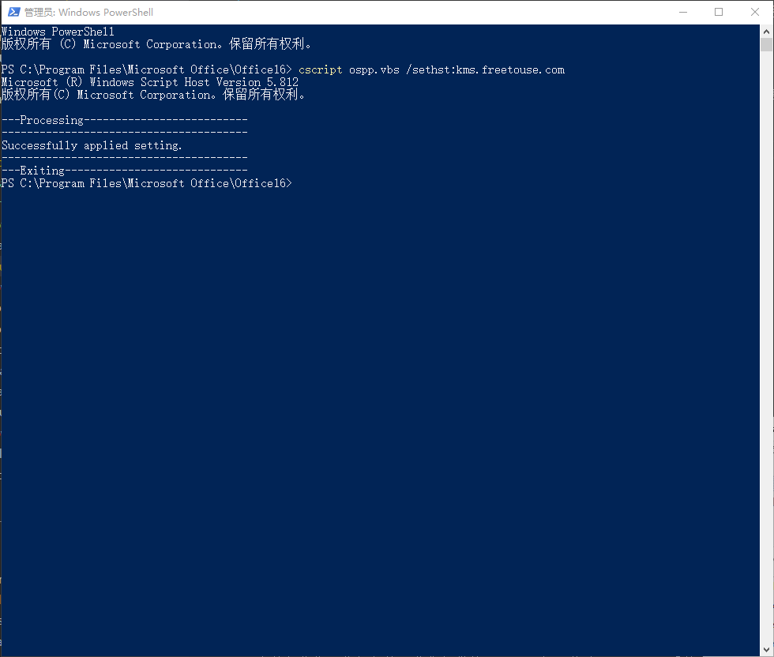

:::tip
适用于：批量许可版本的 Office LTSC 2022、Office 2019 和 Office 2016（包括 Project 和 Visio）。
:::

本教程将指导你如何使用我们提供的 KMS 服务器激活 Office 套件。

Office 的所有批量许可版本（包括 Project 和 Visio）都预安装了通用批量许可密钥 (GVLK)。 GVLK 支持密钥管理服务 (KMS) 激活和基于 Active Directory 的激活。在你的计算机上配置为我们提供的 kms.freetouse.com 激活服务器后，你只需要安装和启用一个 KMS 主机秘钥，即可激活 Office 的所有批量许可版本。

无需执行任何其他操作即可通过 KMS 启用 Office 激活。 KMS 客户端可以通过查询发布 KMS 服务的服务 (SRV) 资源记录 (RR) 的 DNS 来自动查找 KMS 主计算机。

## 安装 Office 套件并打开安装目录

如果你的计算机上没有安装 Office 套件，你可以从[这里](./download)下载受支持的 Office 原版套件安装程序。

安装 Office 套件后，打开安装目录。例如，如果你在 Windows 10 操作系统中安装了 Office 2016，你可以在 `C:\Program Files\Microsoft Office\Office16` 找到安装目录。若没有找到，你可以在开始菜单中找到 Office 2016，右键单击并选择“打开文件位置”。



## 设置 Office 秘钥管理服务主机

在 Office 2016 安装目录中编辑地址，输入 powershell 或 cmd，然后按下键盘上的回车（Enter）键。这里以 powershell 为例：



在弹出的窗口中输入以下命令：

```powershell
cscript ospp.vbs /sethst:kms.freetouse.com
```

上面的命令将设置 KMS 主机为 kms.freetouse.com。设置成功后，命令行中将打印一句 `Successfully applied setting.`，表示设置成功。

如果一切顺利，你将看到以下输出：



## 激活 Office 套件

我们仍然以 Office 2016 为例，输入以下命令：

```powershell
cscript ospp.vbs /act
```

这句话的意思表示激活 Office 2016。如果一切顺利，你将看到以下输出：

```powershell
PS C:\Program Files\Microsoft Office\Office16> cscript ospp.vbs /act
Microsoft (R) Windows Script Host Version 5.812
版权所有(C) Microsoft Corporation。保留所有权利。

---Processing--------------------------
---------------------------------------
Installed product key detected - attempting to activate the following product:
SKU ID: 041a06cb-c5b8-4772-809f-416d03d16654
LICENSE NAME: Office 16, Office16PublisherVL_KMS_Client edition
LICENSE DESCRIPTION: Office 16, VOLUME_KMSCLIENT channel
Last 5 characters of installed product key: 8K837
<Product activation successful>
---------------------------------------
Installed product key detected - attempting to activate the following product:
SKU ID: 4f414197-0fc2-4c01-b68a-86cbb9ac254c
LICENSE NAME: Office 16, Office16ProjectProVL_KMS_Client edition
LICENSE DESCRIPTION: Office 16, VOLUME_KMSCLIENT channel
Last 5 characters of installed product key: G83KT
<Product activation successful>
---------------------------------------
Installed product key detected - attempting to activate the following product:
SKU ID: 67c0fc0c-deba-401b-bf8b-9c8ad8395804
LICENSE NAME: Office 16, Office16AccessVL_KMS_Client edition
LICENSE DESCRIPTION: Office 16, VOLUME_KMSCLIENT channel
Last 5 characters of installed product key: QPFDW
<Product activation successful>
---------------------------------------
Installed product key detected - attempting to activate the following product:
SKU ID: 6bf301c1-b94a-43e9-ba31-d494598c47fb
LICENSE NAME: Office 16, Office16VisioProVL_KMS_Client edition
LICENSE DESCRIPTION: Office 16, VOLUME_KMSCLIENT channel
Last 5 characters of installed product key: RJRJK
<Product activation successful>
---------------------------------------
Installed product key detected - attempting to activate the following product:
SKU ID: bb11badf-d8aa-470e-9311-20eaf80fe5cc
LICENSE NAME: Office 16, Office16WordVL_KMS_Client edition
LICENSE DESCRIPTION: Office 16, VOLUME_KMSCLIENT channel
Last 5 characters of installed product key: 3PFJ6
<Product activation successful>
---------------------------------------
Installed product key detected - attempting to activate the following product:
SKU ID: c3e65d36-141f-4d2f-a303-a842ee756a29
LICENSE NAME: Office 16, Office16ExcelVL_KMS_Client edition
LICENSE DESCRIPTION: Office 16, VOLUME_KMSCLIENT channel
Last 5 characters of installed product key: 7FTBF
<Product activation successful>
---------------------------------------
Installed product key detected - attempting to activate the following product:
SKU ID: d70b1bba-b893-4544-96e2-b7a318091c33
LICENSE NAME: Office 16, Office16PowerPointVL_KMS_Client edition
LICENSE DESCRIPTION: Office 16, VOLUME_KMSCLIENT channel
Last 5 characters of installed product key: BY6C6
<Product activation successful>
---------------------------------------
Installed product key detected - attempting to activate the following product:
SKU ID: d8cace59-33d2-4ac7-9b1b-9b72339c51c8
LICENSE NAME: Office 16, Office16OneNoteVL_KMS_Client edition
LICENSE DESCRIPTION: Office 16, VOLUME_KMSCLIENT channel
Last 5 characters of installed product key: XW3J6
<Product activation successful>
---------------------------------------
Installed product key detected - attempting to activate the following product:
SKU ID: da7ddabc-3fbe-4447-9e01-6ab7440b4cd4
LICENSE NAME: Office 16, Office16ProjectStdVL_KMS_Client edition
LICENSE DESCRIPTION: Office 16, VOLUME_KMSCLIENT channel
Last 5 characters of installed product key: KQBVC
<Product activation successful>
---------------------------------------
Installed product key detected - attempting to activate the following product:
SKU ID: ec9d9265-9d1e-4ed0-838a-cdc20f2551a1
LICENSE NAME: Office 16, Office16OutlookVL_KMS_Client edition
LICENSE DESCRIPTION: Office 16, VOLUME_KMSCLIENT channel
Last 5 characters of installed product key: 6MT9B
<Product activation successful>
---------------------------------------
---------------------------------------
---Exiting-----------------------------
```

上面的输出表示 Office 2016 套件的各个产品已经成功激活。我们注意到 `LICENSE NAME` 列表中包含了 Office 2016 的各个产品，例如 Word、Excel、PowerPoint 等。在各个产品后面的 `<Product activation successful>` 则表示该产品激活成功。

## 检查 Office 套件的激活状态

我们还可以检查 Office 套件的授权状态。输入以下命令：

```powershell
cscript ospp.vbs /dstatus
```

这个命令将使用 cscript 工具来运行 ospp.vbs 脚本，并显示 Microsoft Office 软件的详细授权信息，包括许可证类型、授权状态、授权到期日期等。这个命令通常用于查看当前 Microsoft Office 软件的授权状态，以便确认软件是否已经成功激活。

到此，我们已经成功激活了 Office 2016 套件。

:::tip
如果你的电脑上安装了 Office 2019 或者 Office 2022，你可以使用同样的方法激活它们。如果你的电脑上没有安装 Office，你可以在[这里](./download)下载受支持的原版 Office 套件。
:::
